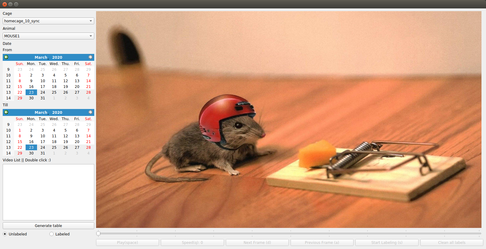

# HomecageSinglePellet_Manual
The gui for labeling events in homecage recorded videos, and also can generate the sumarry out of log files.
## 1. Dependencies
* If you already have the environment built for HomeCageSinglePellet_server, then you can reuse that environment and skip the following steps.
* 1. conda install opencv==3.4.1
* The libararies you may need to install are listed as (Most of them are preinstalled by anaconda, except opencv):
* 1. panadas
* 2. tkinter
* 3. pyqt5
* 4. tqdm
* 5. shutil
## 2. GUI

## 3. How to run the script and generate tables.
* 1. `conda activate [your environment containing the dependencies]`
* 2. `cd HomecageSinglePellet_Manual`
* 3. `python gui_enhanced.py`
* 4. click on the button `Generate table`. If it shuts down immediately, then click it again. (It is because the initializing step have not finished yet.)
* 5. You will find the generated csv forms under forms folder. 
